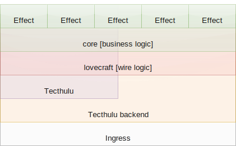

# Navarro code
*Bringing the Holy Light of Saint Jarvis to His Meditation Garden.*

## About

In approximately one month, the second Ingress portal luminance project (PLP) event will be held at Camp Navarro, California, and we will be there with a meditation garden dedicated to our most holy Saint Jarvis.

Last year, this author was the tech lead for a similar PLP. This document is greatly influenced by that experience.

## Requirements
This system **must**:

- connect to an 802.11 wireless network (potentially with WEP/WPA encryption)
- make HTTP(S) requests to a Niantic-provided IP address and TCP port
- parse JSON data received to determine portal status using the "Tecthulu" API
- determine changes in portal status
- make portal status changes available to consuming systems

This system **should**:

- parse JSON data recieved to determine portal status using the "upstream" API
- display portal status in human-readable form
- log portal status changes for later use and analysis

## Design goals

### Maintainable
The performance requirements for this software are minimal. The upstream data source is <1KB, updated about once a second. Even on a relatively constrained system, this is *exceptionally* low bandwidth.

Given the modest performance needs, the **primary goal** should be to have easily maintainable (and adaptable) code.[1](#f1)

### Power efficient
Ultimately, our assigned site may not have dedicated AC power. There is a non-zero chance that this code will be running on a Raspberry Pi powered by a portable USB power pack. Given this potential, any code should be optimized for power consumption.

### Data agnostic
The Tecthulu API is not particularly stable or well-documented, and is subject to change before the event. In addition, last year the provided Tecthulu device failed[1](#f1), which required rewriting the software to use the Tecthulu's upstream data source instead (which had an entirely different data representation).

Unfortunately, there's no guarantee that we'll be granted access to this upstream API this year, so we can't plan to use it—**but we should if we can.**

To promote this goal, the code may be separated into "wire" (network and data-handling) code and "business" (core logic) code.

### Portable
As previously mentioned, this code may be required to run on multiple different platforms.
To support this goal, dependencies **should** be ensured to be available on *at least*:

  - Linux
    - ARM (Raspberry Pi/Arduino)
    - x64
  - Darwin/x64
  - Windows(?)

### Modular
The plan for the PLP is to have a number of small projects that can be reconfigured as necessary on-site. It **may** be worthwhile to structure the software similarly, if there are potentially large numbers of "client" projects.

## Architecture

---
1. <b id='f1'>NB</b>: This should mitigate last year's experience of spending most of the weekend attempting to troubleshoot a failed Tecthulu and then replacing the network code.[↩](#a1)
